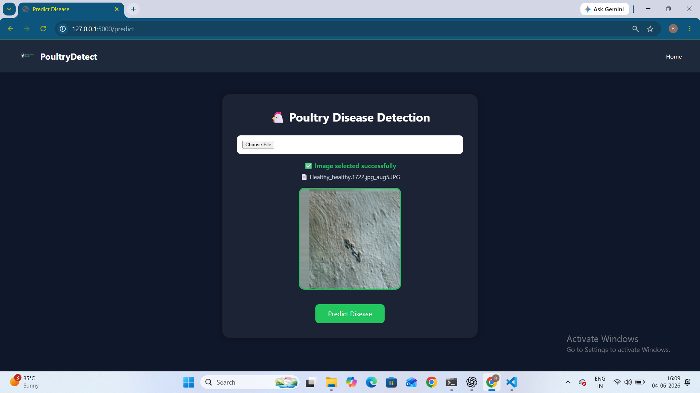
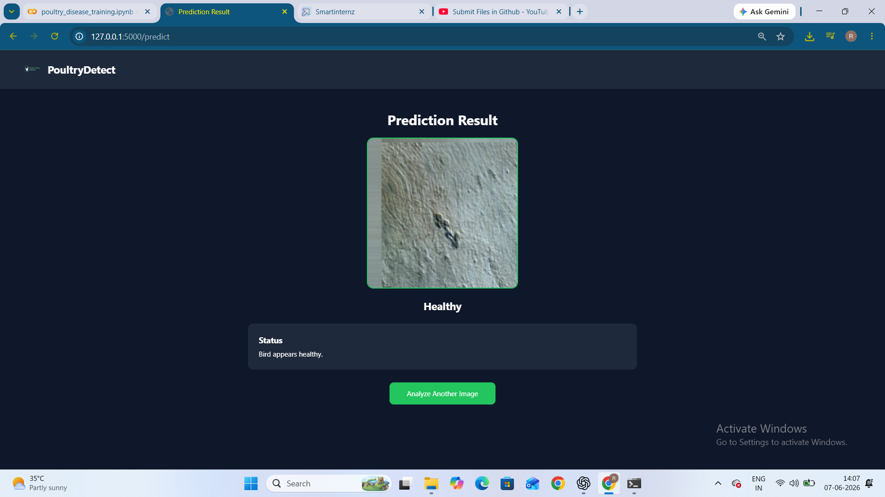
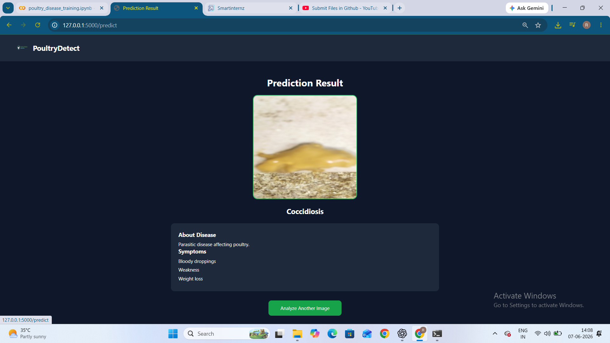
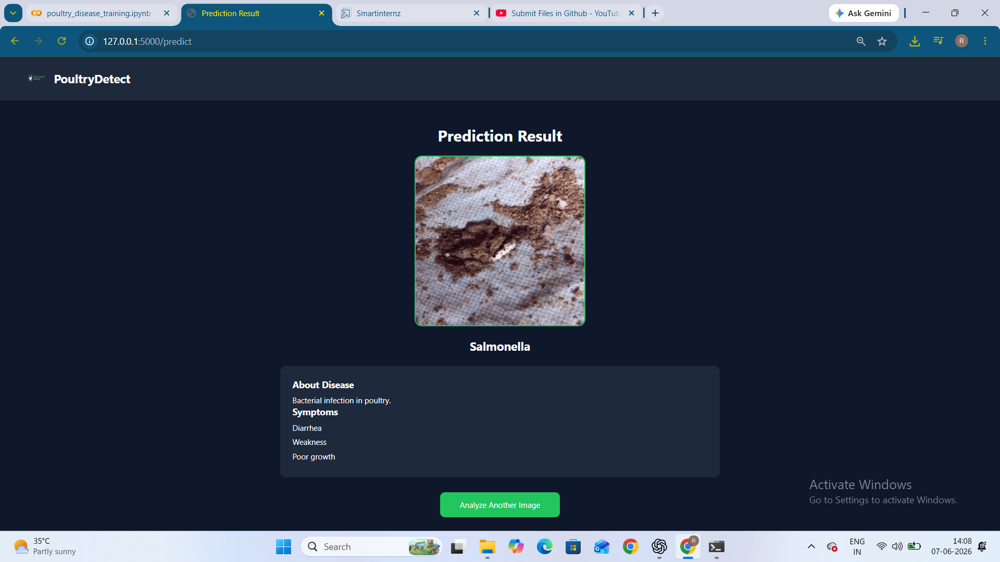
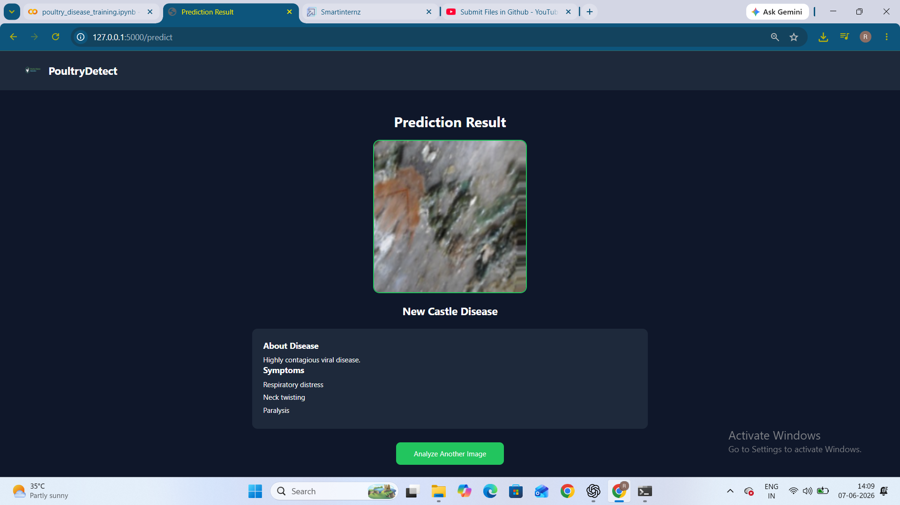

# Poultry Disease Detection System

## Project Overview

This project uses Transfer Learning with the VGG16 deep learning model to classify poultry diseases from poultry images.

The system predicts one of the following classes:

* Healthy
* Coccidiosis
* New Castle Disease
* Salmonella

A Flask web application is integrated with the trained model to provide real-time disease prediction through a simple and user-friendly interface.

---

## Features

* VGG16 Transfer Learning Model
* Poultry Disease Classification
* Image Upload and Preview
* Real-Time Disease Prediction
* Flask Web Application
* Responsive User Interface
* Sample Test Images
* Project Documentation
* Project Demonstration Video

---

## Technologies Used

* Python
* TensorFlow
* Keras
* Flask
* HTML
* CSS
* NumPy
* OpenCV
* Git
* GitHub

---

## Dataset

Dataset Source:

https://www.kaggle.com/datasets/chandrashekarnatesh/poultry-diseases

Classes:

* Healthy
* Coccidiosis
* New Castle Disease
* Salmonella

A subset of the dataset was used for training and testing purposes.

---

## Project Structure

```text
PoultryDiseaseProject
│
├── document/
│   └── Poultry_Disease_Report.docx
│
├── video_demo/
│   └── Poultry_Disease_Detection_Demo.mp4
│
├── app.py
├── requirements.txt
├── README.md
│
├── static/
├── templates/
├── screenshots/
├── sample_images/
├── model/
├── dataset/
└── notebooks/
```

---

## Application Screenshots

### Home Page


### Prediction Page


### Image Upload



### Healthy Prediction



### Coccidiosis Prediction



### Salmonella Prediction



### New Castle Disease Prediction



---

## Installation

```bash
pip install -r requirements.txt
python app.py
```

Open:

```text
http://127.0.0.1:5000
```

---

## Results

The developed system successfully classifies poultry diseases into:

* Healthy
* Coccidiosis
* New Castle Disease
* Salmonella

using a VGG16 Transfer Learning model integrated with a Flask web application.

---

## Project Report

Project documentation is available in:

```text
document/Poultry_Disease_Report.docx
```

---

## Demonstration Video

Project demonstration video is available in:

```text
video_demo/
```

---

## Future Improvements

* Improve model accuracy using larger datasets
* Deploy the application to cloud platforms
* Add confidence score visualization
* Support mobile-friendly deployment

---

## Author

**BORA RAJA GOPALA REDDY**

GitHub:
https://github.com/rg-reddy

LinkedIn:
https://www.linkedin.com/in/raja-gopala-reddy-bora-754b172a1
