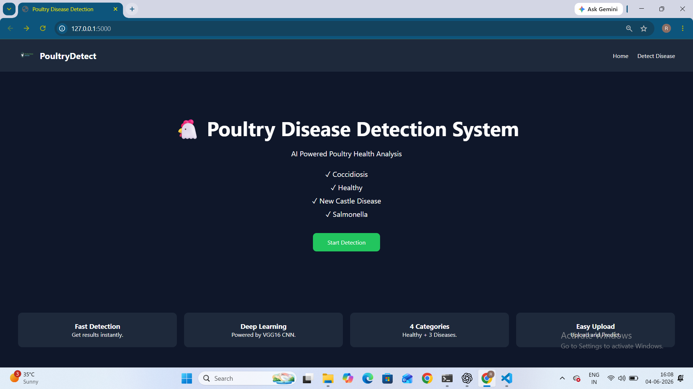
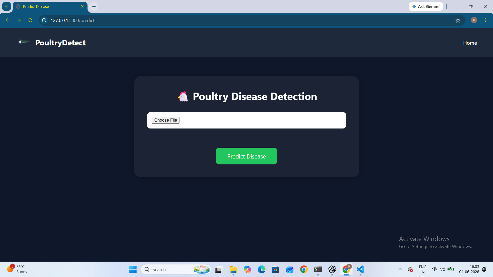
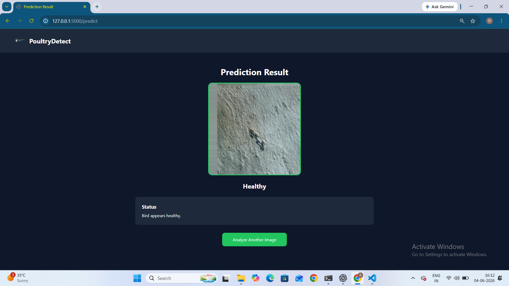
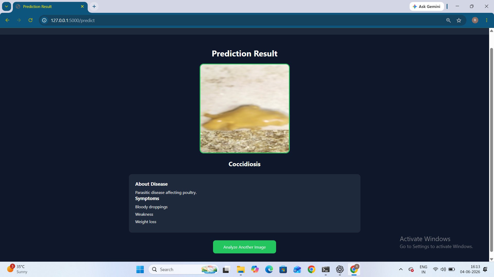
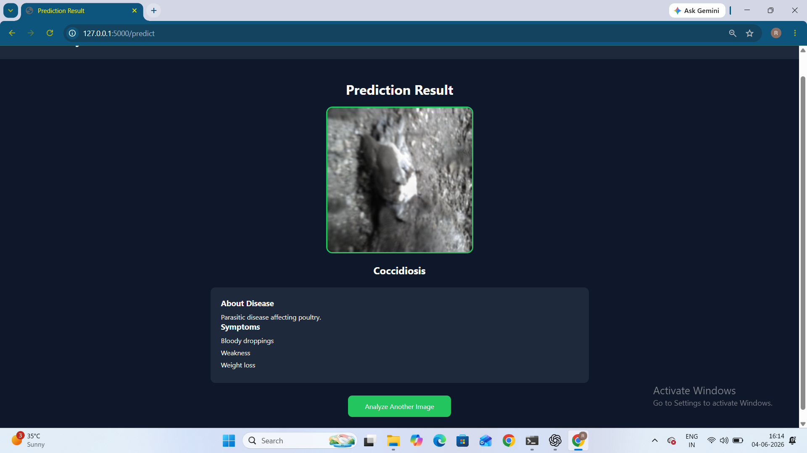
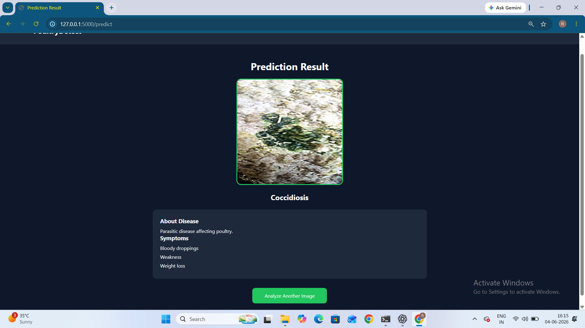

# Poultry Disease Detection System

## Project Overview

This project uses Transfer Learning with the VGG16 deep learning model to classify poultry diseases from images.

The application allows users to upload poultry images and predicts one of the following classes:

* Healthy
* Coccidiosis
* New Castle Disease
* Salmonella

A Flask web application is integrated with the trained model to provide real-time disease prediction.

---

## Features

* VGG16 Transfer Learning
* Poultry Disease Classification
* Image Upload & Preview
* Real-Time Prediction
* Flask Web Application
* Responsive User Interface

---

## Technologies Used

* Python
* TensorFlow
* Keras
* Flask
* HTML
* CSS
* NumPy
* OpenCV

---

## Dataset

Dataset Source:

Poultry Pathology Visual Dataset (Kaggle)

Classes:

* Healthy
* Coccidiosis
* New Castle Disease
* Salmonella

For efficient training, a subset of images from each class was used.

---

## Project Structure

```text
PoultryDiseaseProject
│
├── app.py
├── requirements.txt
├── README.md
│
├── static
├── templates
├── screenshots
├── sample_images
│
└── model
```

---

## Application Screenshots

### Home Page



### Prediction Page



### Image Selected


### Healthy Prediction



### Coccidiosis Prediction



### Salmonella Prediction



### New Castle Disease Prediction



---

## Installation

```bash
pip install -r requirements.txt
python app.py
```

Open:

```text
http://127.0.0.1:5000
```

---

## Results

The system successfully classifies poultry images into:

* Healthy
* Coccidiosis
* New Castle Disease
* Salmonella

using a Transfer Learning based VGG16 model.

---

## Note

The trained model file is not included in this repository because the file size exceeds GitHub's standard upload limits.

---

## Author

BORA RAJA GOPALA REDDY

GitHub:
https://github.com/rg-reddy
